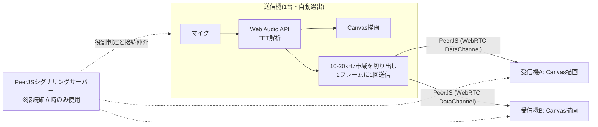

# AuraSonic HF Zoom — リアルタイム高周波スペクトルアナライザー

マイクで拾った音のうち、人間には聞き取りにくい**高周波帯域(10 kHz〜20 kHz)だけを拡大表示**するブラウザアプリです。さらに WebRTC を使った P2P 通信で、1台のマイクで測定した結果を他の端末にリアルタイム転送(ミラーリング)できます。

🎮 公開ページ: 'https://otonasi-muonn.github.io/kousyuuha_kennti/'

## 概要

「スピーカーから高周波音が本当に出ているのか」「どの周波数がどのくらいの強さで鳴っているのか」は、耳で確認するのが困難です。特に 15 kHz 以上の音は多くのスピーカーが物理的に出力できず、大人の耳では聞こえないことも多いためです。

このアプリは、スマートフォンやPCのブラウザだけで次のことを可能にします。

- マイク入力を FFT(高速フーリエ変換。音を周波数ごとの成分に分解する処理)で解析し、10〜20 kHz の帯域をズーム表示する
- 帯域内で最も強い周波数(ピーク)を自動検出し、「ピーク: 17,000 Hz (-42.0 dB)」のように数値で表示する
- スピーカーの近くに置いた1台を「送信機」、手元の端末を「受信機」として、測定結果を複数端末へリアルタイム配信する

アプリのインストールは不要で、GitHub Pages 上のページを開くだけで動作します。

## メイン機能

### 1. 高周波帯域のズーム表示

- **何ができるか**: マイクが拾った音のスペクトルのうち、10 kHz〜20 kHz の範囲だけを画面いっぱいに拡大表示します。
- **使う場面**: 高周波音源(モスキート音など)が実際に鳴っているかを目で確認したいとき。
- **内部処理**: Web Audio API の `AnalyserNode`(FFT サイズ 1024)で周波数ごとの音量(dB)を取得し、サンプリングレートから 10〜20 kHz に対応する FFT ビン(周波数の区画)だけを切り出して Canvas に描画します。

### 2. ピーク周波数の自動トラッキング

- **何ができるか**: 表示帯域内で最も音量が大きい周波数を検出し、黄色いガイドラインとラベルで「何 Hz が何 dB で鳴っているか」を示します。
- **使う場面**: 「17 kHz のテスト音を再生したはずだが、本当にその周波数が出ているか」を確認するとき。
- **内部処理**: 描画フレームごとに帯域内の全ビンを走査して最大 dB のビンを特定し、ビン番号から周波数を逆算します。ノイズによる誤表示を避けるため、-75 dB より小さいピークは表示しません。

### 3. 役割自動判定つき P2P ミラーリング

- **何ができるか**: ページを開いた端末同士が自動で「送信機(マイク係)」と「受信機(表示係)」に分かれ、送信機の測定結果が受信機の画面にリアルタイムで映ります。受信機は複数台接続できます。
- **使う場面**: スピーカーの真横に置いた端末で測定しつつ、離れた場所にいる複数人が手元の端末で結果を見るとき。
- **内部処理**: PeerJS(WebRTC のラッパーライブラリ)で固定 ID `aurasonic-master-sender` の取得を試み、取得できた端末が送信機、「ID が使用中」エラーになった端末は自動的に受信機になります。送信機は FFT データのうち 10〜20 kHz 分だけを切り出し、データチャネル経由で全受信機へブロードキャストします。

### 4. 高周波を殺さないマイク設定

- **何ができるか**: ブラウザ標準の音声フィルタを無効化し、高周波成分をそのまま解析に回します。
- **内部処理**: `getUserMedia` の制約で `echoCancellation` / `noiseSuppression` / `autoGainControl` をすべて `false` に指定しています。これらの補正は通話品質向上のためのもので、有効のままだと高周波が減衰・除去されてしまうためです。

## 使い方

1. **送信機にする端末**でページを開く(最初に開いた端末が自動的に送信モードになり、バナーに「📡 送信モード」と表示されます)
2. 送信機をスピーカーの近くに置き、「⚡ 測定開始 (マイク起動)」ボタンを押してマイクを許可する
3. **受信機にする端末**で同じページを開く(自動的に「📱 受信モード」になり、送信機と同期します)
4. 音を再生し、各端末の画面でスペクトル波形とピーク周波数を確認する

補足:

- スマートフォンでマイクを使うには **HTTPS 接続が必須**です(エラー時に画面上でも案内されます)。
- Bluetooth マイクは高域が自動カットされるため、本体内蔵マイクの使用を推奨します(画面上の注意書きより)。

## 技術スタック

| 分類 | 技術 | 用途 |
| --- | --- | --- |
| 言語 | JavaScript (ES Modules) / HTML / CSS | アプリ全体。フレームワークは使わず素の DOM 操作で構築 |
| 音声処理 | Web Audio API (`AnalyserNode`) | マイク入力の FFT 解析 |
| 描画 | Canvas 2D API | スペクトル波形・グリッド・ピーク表示の描画 |
| 通信 | PeerJS 1.5.2 (CDN 読み込み) | WebRTC による端末間 P2P データ転送 |
| ビルドツール | Vite 5 | 開発サーバーと本番ビルド |
| 開発ツール | @vitejs/plugin-basic-ssl | 開発サーバーの HTTPS 化(モバイルでのマイク利用に必要) |
| インフラ | GitHub Pages + GitHub Actions | main ブランチへの push で自動ビルド・デプロイ |

## 技術的な見どころ

### サーバーレスな役割自動判定(リーダー選出)

- **何を実現しているか**: 専用サーバーや設定画面なしで、複数端末が自動的に「送信機1台+受信機N台」の構成に収束します。
- **なぜ重要か**: 通常、どの端末が親になるかを決めるにはシグナリングサーバー側の調停や手動でのルーム ID 入力が必要になります。利用者に設定をさせない仕組みは UX 上の大きな差になります。
- **どう実装しているか**: PeerJS の「同じ ID は同時に1つしか登録できない」という性質を排他制御として利用しています。全端末がまず固定 ID `aurasonic-master-sender` での登録を試み、成功した1台だけが送信機になり、`unavailable-id` エラーを受けた端末は受信機モードへ移行します(`src/main.js` の `autoNegotiateRole()`)。
- **効果**: ページを開くだけで役割が決まるため、URL を共有するだけで複数人での同時観測ができます。

### P2P 転送量の削減(帯域スライス+フレーム間引き)

- **何を実現しているか**: 測定結果を複数端末へ送り続けても破綻しない、軽量なリアルタイム配信。
- **なぜ重要か**: FFT の生データを毎フレーム(約60回/秒)全受信機に送ると、データ量が多く遅延や詰まりの原因になります。
- **どう実装しているか**: 送信前に FFT 全 512 ビンから表示に必要な 10〜20 kHz 分のビンだけを `slice` で切り出し、さらに送信を2フレームに1回に間引いています(`sendThrottleCount % 2 === 0`)。受信側は `isPreSliced` フラグつきの描画パスで、切り出し済みデータをそのまま描画します。
- **効果**: 転送データを「画面に映る分だけ」に絞ることで、複数の受信機が接続してもリアルタイム性を保てます。

### 切断からの自動復帰

- **何を実現しているか**: 送信機の再起動や電波状況の悪化で接続が切れても、受信機が自動で再接続します。
- **なぜ重要か**: P2P 接続はネットワーク環境の影響を受けやすく、手動での再読み込みを前提にすると実用に耐えません。
- **どう実装しているか**: 受信機側で接続の `close` / `error` イベントを監視し、2〜3秒後に `startViewerMode()` を再実行して送信機を探し直します。役割判定自体の失敗時も 3 秒後に `autoNegotiateRole()` をリトライします。切断時は画面上部のステータスバナーに状態(再接続中など)を表示します。
- **効果**: 一時的な切断があっても放置しておけば同期が復活し、常設のモニターとしても使えます。

### dB 正規化と高精細対応の Canvas 描画

- **何を実現しているか**: 測定器らしい読み取りやすいスペクトル表示(dB グリッド、グラデーション塗り、発光する波形線、ピークガイド)。
- **なぜ重要か**: FFT の生データは -90〜0 dB 程度の対数値で、そのまま描くと変化が読み取れません。また高解像度ディスプレイでは Canvas がぼやけます。
- **どう実装しているか**: 各ビンの dB 値を -90〜-15 dB の範囲で 0〜1 に正規化して縦位置に変換し、-90/-75/…/-15 dB のグリッド線と併せて描画します。Canvas は `devicePixelRatio` を掛けた実ピクセルサイズで確保し、リサイズにも追従させています(`resizeCanvas()`)。
- **効果**: スマートフォンの高解像度画面でも波形やラベルが鮮明に表示され、音量差を dB 目盛りで定量的に読み取れます。

## システム構成・処理の流れ



接続の確立(役割判定と相手探し)には PeerJS の公開シグナリングサーバーを使いますが、確立後の測定データは端末間の P2P で直接流れます。

## 環境構築

### 必要なソフトウェア

- Node.js 20(CI で使用しているバージョン)
- npm

### インストールと起動

```bash
# 依存パッケージのインストール
npm install

# 開発サーバーの起動(HTTPS・LAN内の他端末からアクセス可能)
npm run dev
```

開発サーバーは `@vitejs/plugin-basic-ssl` により自己署名証明書の HTTPS で起動します(ポート 5173)。スマートフォンで動作確認する場合は、同じ LAN 内から `https://<PCのIPアドレス>:5173` にアクセスし、証明書の警告を許可してください。

### ビルドとデプロイ

```bash
# 本番ビルド(dist/ に出力)
npm run build

# ビルド結果のローカル確認
npm run preview

# 手動デプロイ(gh-pages ブランチへ)
npm run deploy
```

`main`(または `master`)ブランチへ push すると、GitHub Actions(`.github/workflows/deploy.yml`)が自動でビルドし GitHub Pages へデプロイします。`vite.config.js` の `base: './'` は、GitHub Pages のサブディレクトリ配信でもアセットパスが壊れないようにするための設定です。

## ディレクトリ構成

```text
├── index.html                     # 画面全体のHTML(PeerJSはCDNから読み込み)
├── src/
│   ├── main.js                    # 役割自動判定・P2P通信・Canvas描画・UI制御
│   ├── analyzer.js                # AudioAnalyzerクラス(マイク入力とFFT解析)
│   └── style.css                  # ダークテーマのスタイル定義
├── vite.config.js                 # Vite設定(HTTPS開発サーバー・相対パス出力)
└── .github/workflows/deploy.yml   # GitHub Pagesへの自動デプロイ設定
```

## 今後の改善点

コードから確認できる範囲で、以下の改善余地があります。

- **未使用の依存関係**: `package.json` の `dependencies` に `ws`(WebSocket ライブラリ)がありますが、コード中では使用されていません。P2P 化以前の名残と思われるため、削除できます。
- **ビルド成果物のコミット**: `dist/` ディレクトリがリポジトリにコミットされていますが、現在は GitHub Actions がビルドを行うため、`.gitignore` に追加して管理外にできます。
- **リポジトリ直下の音源ファイル**: ルートに複数の MP3 ファイルがありますが、コードからは参照されていません。テスト用音源であれば専用ディレクトリへの整理、不要であれば削除が考えられます。
- **送信機の離脱検知**: 送信機がページを閉じた場合、受信機は接続断からの再接続を試み続けますが、新しい送信機への自動昇格(受信機の中から次の送信機を選ぶ処理)は実装されていません。
